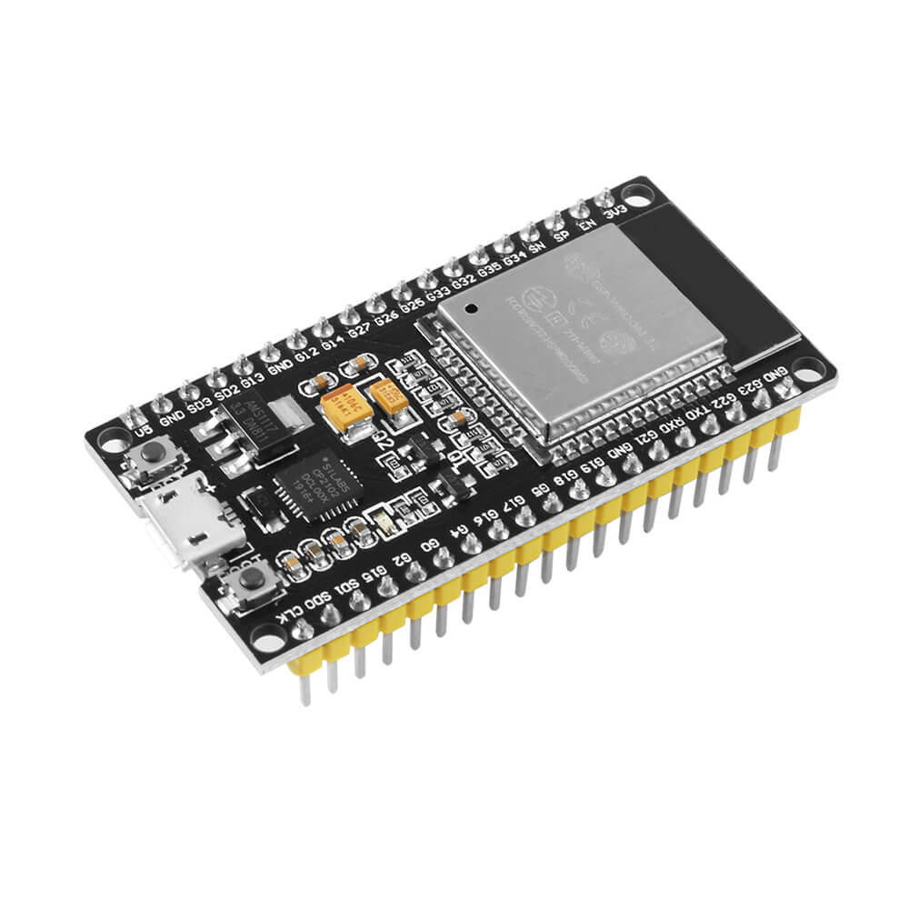
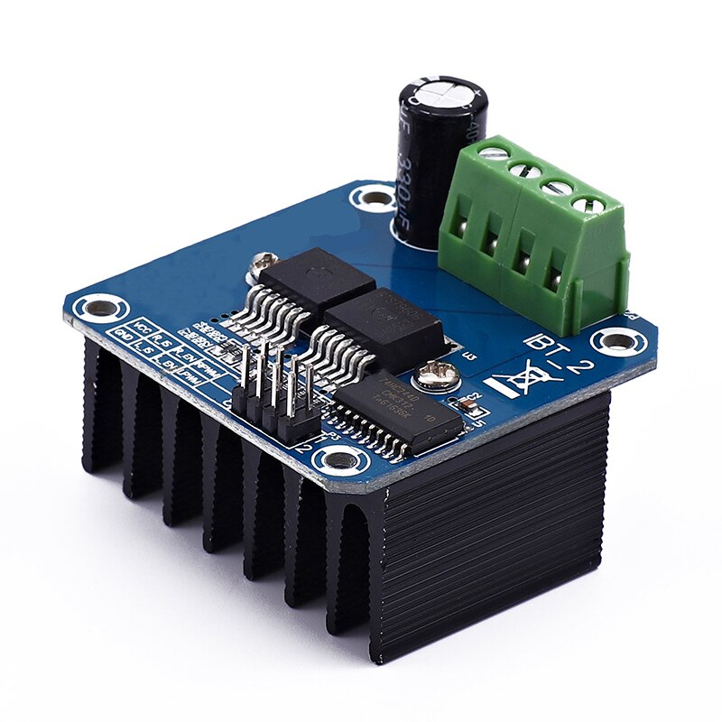
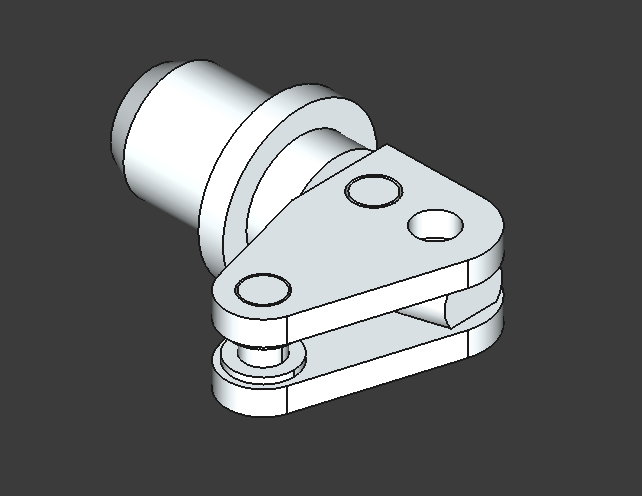

# Phantom Future Engineers 2026 — WRO Robot Documentation

Welcome to the official repository of our WRO Future Engineers robot.  
This repo contains all CAD files, electronics references, photos, and documentation of the current version of our robot.

---

## 📌 Table of Contents
- [Overview](#overview)
- [Robot Images](#robot-images)
- [Electronics](#electronics)
- [3D Models (CAD)](#3d-models-cad)
- [Build Instructions](#build-instructions)
- [Team](#team)
- [License](#license)

---

## Overview
This repository documents the **current version** of our robot for the 2026 WRO Future Engineers season.

We redesigned the entire system:
- new chassis  
- new wheel system  
- new servo + motor configuration  
- updated electronics  
- updated sensors  
- new assembly layout  

Everything in this README corresponds **only** to the robot that exists *right now* — all old, irrelevant sections were removed.

---

## Robot Images

Photos of the latest assembled robot:

  
  

Additional views are available in:  
`/WRO pics/`

---

## Electronics

All components currently used in the robot are in:

`/Electronics`

### Included:
- DC motor  
- MG90S servo  
- BTS7960 driver  
- HC-SR04 ultrasonic sensors  
- BNO080 IMU  
- ESP32  
- XL6009 step-up converter  

  
  

These images serve as reference during wiring and assembly.

---

## 3D Models (CAD)

All STL and CAD files for the robot are stored in:

`/WRO cad`

### Files include:
- Chassis  
- Front cover  
- Custom wheels  
- Spur gears (15T, 45T)  
- HC-SR04 mounts  
- Linkages  
- Back wheel components  

Example previews:

  
  

*(GitHub cannot preview STL thumbnails directly, but files are there.)*

---

## Build Instructions

Assembly reference images are located in:

`/docs`

These include step-by-step visual guides (instructions1–6).

Example:

  

---

## Team

Photos stored in:  
`/team photos`

  

---

## License
This project is released under the **MIT License**.  
See `LICENSE` for details.
